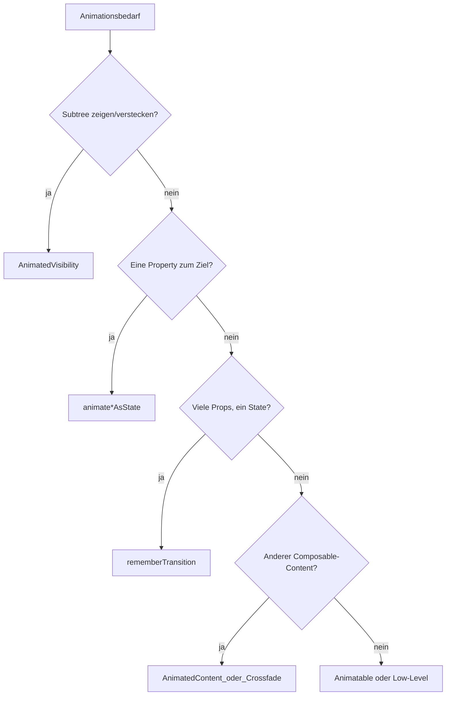

<!-- Deutsche Übersetzung (2026-07-22) von chrisbanes/skills@2026.7.21 (Apache-2.0). Diese Datei wurde geändert: Prosa/Kommentare übersetzt, Code- und API-Bezeichner unverändert. -->

# Compose: Animationen

## Grundprinzip

Wähle die **kleinste API, die zum Problem passt**: zuerst eingebaute Visibility- und Layout-Transitions, dann ein einzelner animierter Wert, dann ein geteiltes Transition-Objekt, wenn mehrere Werte zusammen bewegt werden müssen, dann Gesten-Level- oder imperative APIs, wenn das Framework die Bewegung nicht ausdrücken kann.

## Review-Vorgehen

1. Identifiziere die visuelle Aufgabe: Zeigen/Verstecken, ein Wert, koordinierte Werte, Content-Tausch, Größenänderung oder gestengetriebene Bewegung.
2. Wähle die kleinste API aus der Tabelle unten.
3. Prüfe die Lifecycle-Semantik: Soll versteckter Content die Composition verlassen, Fokus/State behalten oder nur transparent werden?
4. Prüfe Identität: Für State-Holder-Wrapper wähle `AnimatedContent.contentKey` nach visueller Form statt nach Payload-Churn.
5. Prüfe Performance: Halte frame-rate-Animationswerte als `State` und lies sie wo möglich in Layout-/Draw-Block-Modifiern.
6. Eskaliere nur zu `Animatable` oder Low-Level-APIs, wenn Target-State-Animation die Bewegung nicht ausdrücken kann.

## Die kleinste Animations-API wählen

| Bedarf | API |
|---|---|
| Einen Subtree zeigen/verstecken mit Enter-/Exit-Semantik; Content wird nach Abschluss des Exits entfernt | [`AnimatedVisibility`](https://developer.android.com/develop/ui/compose/animation/composables-modifiers#animatedvisibility) |
| Eine Property zu einem aus State abgeleiteten Ziel animieren | [`animateFloatAsState`](https://developer.android.com/develop/ui/compose/animation/value-based#animate-as-state) / `animateDpAsState` / `animateColorAsState` / `animateOffsetAsState` / … |
| Mehrere animierte Werte, gekeyt auf ein Boolean, Enum oder sealed State | `rememberTransition` + Transition-Child-Animationen (`animateFloat`, `animateDp`, `animateColor`, `animateValue`, …) |
| Sanfte Größe, wenn sich Child-Layout-Höhe/-Breite ändert (z. B. Text bricht um) | `Modifier.animateContentSize()` |
| Zwischen verschiedenen Composable-Bäumen für denselben Slot wechseln | `AnimatedContent` oder `Crossfade` |
| Nutzergetriebene Bewegung (Drag, Fling, unterbrechbare Springs) | [`Animatable`](https://developer.android.com/reference/kotlin/androidx/compose/animation/core/Animatable) und verwandte Coroutine-APIs (siehe Advanced-Verweise) |

## Erscheinen und verschwinden

**Bevorzuge `AnimatedVisibility`**, wenn die UI den Baum mit Enter-/Exit-Transitions verlassen oder ihm beitreten soll.

```kotlin
AnimatedVisibility(visible = expanded) {
    Text("Details…")
}
```

**`animateFloatAsState` auf alpha** blendet nur; das Composable **bleibt in der Composition** und nimmt weiter am Layout teil, außer du gatest es selbst. Nutze diesen Tradeoff, wenn du Kinder bewusst gemountet hältst (State, Fokus), aber visuell versteckst. Für echtes Aus-dem-Baum-Entfernen nutze `AnimatedVisibility` (oder bedingte Composition mit `AnimatedVisibility`-/`AnimatedContent`-Mustern aus dem [Quick Guide](https://developer.android.com/develop/ui/compose/animation/quick-guide)).

## Hintergrundfarbe

Nutze `animateColorAsState` für sanfte Farbziele.

Für animierte Füllungen hinter Kindern empfiehlt der [Quick Guide](https://developer.android.com/develop/ui/compose/animation/quick-guide) das Zeichnen mit **`Modifier.drawBehind`** statt `Modifier.background()`, damit die animierte Farbe performance-gerecht in der Draw-Phase angewendet wird.

```kotlin
val background = animateColorAsState(
    targetValue = if (selected) selectedColor else idleColor,
    label = "background",
)
Box(
    Modifier.drawBehind { drawRect(background.value) },
) { /* content */ }
```

## Größenänderungen

`Modifier.animateContentSize()` animiert Layout-Größenänderungen — üblich für expandierenden/kollabierenden Text oder dynamische Chips — ohne handgeschriebene Width-/Height-Animationen.

## Wert-basierte Animationen (`animate*AsState`)

Compose bietet `animate*AsState` für `Float`, `Dp`, `Color`, `Size`, `Offset`, `Rect`, `Int`, `IntOffset`, `IntSize` und mehr. Du lieferst das **Ziel**; die API besitzt den Animations-State.

- Übergib eine [`AnimationSpec`](https://developer.android.com/reference/kotlin/androidx/compose/animation/core/AnimationSpec) via `animationSpec` (z. B. `spring`, `tween`), wenn die Defaults für die UI falsch sind.
- Setze ein eindeutiges **`label`** für Debugging und Tooling, wenn mehrere Animationen in einem Composable existieren.
- Für Completion- oder Sequencing-Details siehe [Value-based animations](https://developer.android.com/develop/ui/compose/animation/value-based).

```kotlin
val width by animateDpAsState(
    targetValue = if (expanded) 200.dp else 56.dp,
    animationSpec = spring(dampingRatio = 0.7f, stiffness = Spring.StiffnessMedium),
    label = "fabWidth",
)
```

## Mehrere Properties: `rememberTransition`

Wenn ein State (z. B. `enum class Phase { A, B, C }`) **mehrere** animierte Werte im Gleichschritt treiben soll, nutze `rememberTransition` und definiere Child-Animationen auf dieser Transition:

```kotlin
val transition = rememberTransition(targetState = phase, label = "phase")
val alpha by transition.animateFloat(label = "alpha") { target ->
    if (target == Phase.Visible) 1f else 0f
}
val offset by transition.animateDp(label = "offset") { target ->
    if (target == Phase.Visible) 0.dp else 24.dp
}
```

Vermeide mehrere unabhängige `animate*AsState`-Aufrufe, die visuell synchron bleiben sollen, aber driften können, wenn Specs oder Ziele auseinanderlaufen. Älterer Code nutzt evtl. `updateTransition`; bevorzuge `rememberTransition` für neuen Code.

## Zwischen Content-Level-APIs wählen

Nutze den offiziellen [Choose an animation API](https://developer.android.com/develop/ui/compose/animation/choose-api)-Baum, wenn die Tabelle nicht genügt. Komprimierte Regeln:

| Situation | Bevorzuge |
|---|---|
| Gleiches Composable, andere **Zielwerte** für Layout-Properties | `animate*AsState` oder `rememberTransition` |
| Anderer **Composable-Content** für denselben Bereich (Tabs, Steps) | `AnimatedContent` (eigenes `transitionSpec`, `contentKey`) oder einfacheres `Crossfade` |
| Pager-artiges **Wischen zwischen Seiten** | Horizontale Pager-APIs aus den Animations-Docs / Material — folge der Choose-API-Guidance |
| Transitions, die **Navigation Compose** besitzt | Navigations-eigene Transitions nutzen, statt `AnimatedContent` auf denselben Destination-Tausch zu setzen |

**Art-basierte Bewegung** (Illustrationen, Lottie, komplexe Vektor-Timelines) liegt außerhalb dieses Skills; nutze dedizierte Bibliotheken.

## Entscheidungsfluss (grob)



## AnimatedContent-Keys für State-Holder

Wenn `AnimatedContent` einen State-Holder-Wrapper wie `AsyncResult<T>`, `Result<T>` oder ein sealed `UiState` erhält, entscheide, was die Transition tatsächlich auslösen soll. Meist soll die Animation laufen, wenn sich die **Content-Form** ändert (loading → content → error), nicht wenn sich das Payload innerhalb derselben Form ändert.

Nutze `contentKey`, um reichen State auf die Animations-Identität zu mappen:

```kotlin
AnimatedContent(
    targetState = result,
    contentKey = { state ->
        when (state) {
            AsyncResult.Loading -> "loading"
            is AsyncResult.Success -> "content"
            is AsyncResult.Error -> "error"
        }
    },
    label = "profile-content",
) { state ->
    when (state) {
        AsyncResult.Loading -> Loading()
        is AsyncResult.Success -> Profile(state.value)
        is AsyncResult.Error -> ErrorMessage(state.throwable)
    }
}
```

Ohne `contentKey` kann jedes ungleiche `Success(value)` als neuer Content behandelt werden. Das ist nützlich, wenn eine Payload-Änderung animieren soll, aber laut, wenn frische Daten dieselbe Screen-Form aktualisieren.

Wähle Keys nach visueller Form:

| State-Änderung | Typischer `contentKey` |
|---|---|
| Loading → Success → Error | Branch-Key: `"loading"`, `"content"`, `"error"` |
| Success Item A → Success Item B soll crossfaden | Stabile Item-Id |
| Success-Daten-Refresh soll in-place aktualisieren | Konstanter Content-Key für `Success` |
| Fehlermeldungstext ändert sich, aber die Fehler-UI-Form bleibt | Konstanter Content-Key für `Error` |

## Animierte Werte und Composition-Performance

`animate*AsState` gibt `State` zurück, der sich häufig aktualisiert. Speist dieser Wert `Modifier.offset`, `Modifier.graphicsLayer`, scroll-nahes Layout oder andere **frame-rate**-Pfade, vermeide es, ihn im Composable-Body mit `by` zu lesen und dann in Wert-Form-Modifier zu übergeben — nutze stattdessen **Deferred Reads** (Block-Modifier, Draw-/Layout-Lambdas). Siehe [`compose-state-deferred-reads`](../compose-state-deferred-reads/SKILL.md).

Schnellt der Recomposition-Zähler während der Bewegung hoch, ohne Bezug zu schlechter Stabilität, siehe [`compose-recomposition-performance`](../compose-recomposition-performance/SKILL.md).

## Eskalationspunkte

Lade die offiziellen Docs, wenn eines davon zutrifft:

| Bedarf | Beginne mit |
|---|---|
| API-Baum ist noch mehrdeutig | [Choose an animation API](https://developer.android.com/develop/ui/compose/animation/choose-api) |
| Gestengetriebene, unterbrechbare oder abbrechbare Bewegung | [`Animatable`](https://developer.android.com/reference/kotlin/androidx/compose/animation/core/Animatable), Pointer Input, Decay |
| Endlose oder wiederholende Zyklen | [`rememberInfiniteTransition`](https://developer.android.com/reference/kotlin/androidx/compose/animation/core/rememberInfiniteTransition) |
| Seekbarer oder test-kontrollierter Fortschritt | [`SeekableTransitionState`](https://developer.android.com/reference/kotlin/androidx/compose/animation/core/SeekableTransitionState) und verwandte APIs |

## Häufige Fehler

| Fehler | Fix |
|---|---|
| Mit `animateFloatAsState(alpha)` faden, aber erwarten, dass Kinder unmounten | `AnimatedVisibility` nutzen oder den Subtree beim Verstecken aus der Composition entfernen |
| Drei `animateDpAsState`-Aufrufe, die mit einem Enum synchron bleiben müssen | Ein `rememberTransition` + Child-Animationen |
| Animierte Farbe auf `Modifier.background` verursacht Extra-Arbeit | `drawBehind { drawRect(animatedColor) }` gemäß Quick Guide bevorzugen |
| `LaunchedEffect` + manuelles `Animatable` für einfache Target-Animation verketten | `animate*AsState` oder `rememberTransition` bevorzugen, außer Gesten erfordern `Animatable` |
| Navigations-eigene Transitions ignorieren | Nav-APIs für Destination-Transitions nutzen; nicht mit `AnimatedContent` für denselben Tausch duplizieren |
| `AnimatedContent(targetState = asyncResult)` animiert bei jedem Daten-Refresh | `contentKey` nach visueller Form oder stabiler Item-Identität hinzufügen |

## Wann diesen Skill nicht nutzen

- **Side-Effect-Timing** (`LaunchedEffect`, Klicks, die Arbeit starten): nutze [`compose-side-effects`](../compose-side-effects/SKILL.md).
- **Tiefes Performance-Tuning**, wo Snapshot-State gelesen wird: nutze [`compose-state-deferred-reads`](../compose-state-deferred-reads/SKILL.md) als primäre Referenz.
